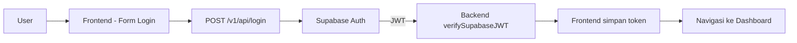
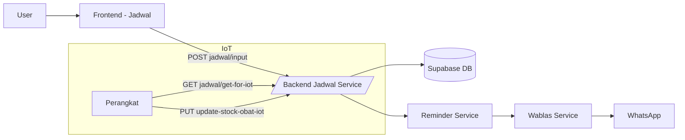
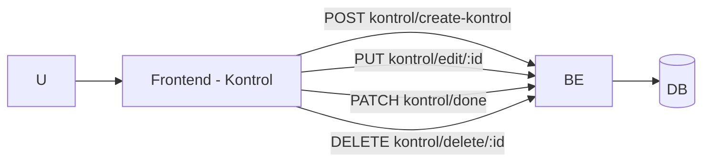
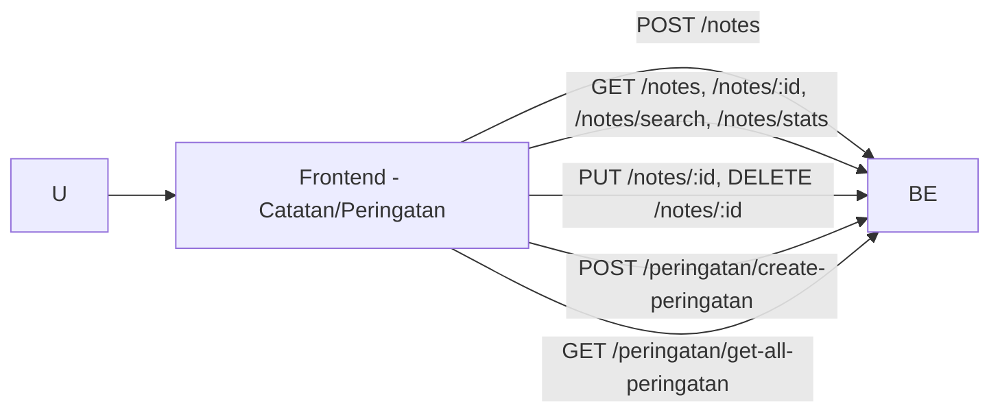
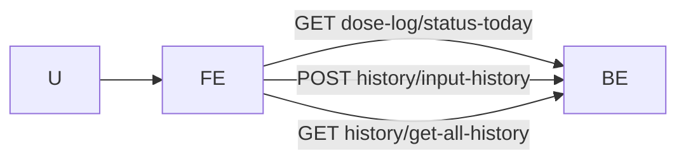
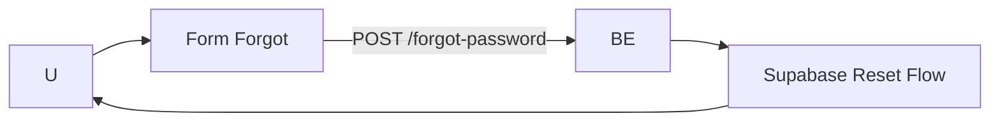

# Deskripsi Produk – Ngombe Obat (SmedBox)

Dokumen ini menjelaskan bentuk, fungsi, dan alur kerja produk aplikasi Ngombe Obat (SmedBox) secara komprehensif dalam perspektif hasil jadi/produk, untuk kebutuhan pengajuan deskripsi karya di HKI.

## Ringkasan

- Aplikasi web untuk membantu pasien mengelola jadwal minum obat dan kontrol dokter, mencatat riwayat konsumsi (dose log), membuat catatan (notes) dan peringatan, serta menerima pengingat via WhatsApp.
- Arsitektur: Frontend React (Vite + Tailwind), Backend Node/Express, Database & Auth via Supabase, Integrasi WhatsApp melalui Wablas API, dukungan IoT untuk sinkron stok obat.

## Persona & Tujuan

- **Pasien/Family**: Mengelola jadwal obat, melihat reminder dan riwayat, menerima notifikasi WA.
- **Server/Operator**: Monitoring stok dan pengelolaan pengingat terjadwal.

## Fitur Utama

- **Autentikasi**: Login, Register, Lupa Password (Supabase Auth + JWT).
- **Jadwal Obat**: Input jadwal, update stok dari Web/IoT, daftar untuk Web/IoT.
- **Kontrol Dokter**: Buat, edit, selesai (done), daftar, dan hapus.
- **Notes**: Buat, lihat, perbarui, cari, statistik, dan hapus.
- **Peringatan**: Buat peringatan manual terkait jadwal, lihat daftar.
- **Dose Log**: Status konsumsi hari ini, pembuatan riwayat manual saat diperlukan.
- **Profil**: Lihat & ubah profil pengguna, ganti password.
- **WhatsApp Reminder**: Pengingat otomatis melalui kanal WhatsApp.
- **Cron**: Penjadwalan pengecekan stok dan tugas rutin (akses admin).

## Halaman Aplikasi

- **Login/Register/Reset**: Autentikasi pengguna.
- **Dashboard**: Ringkasan informasi penting.
- **Jadwal**: Manajemen jadwal obat (buat, lihat, update stok).
- **Kontrol**: Manajemen jadwal kontrol ke dokter (buat, edit, selesai).
- **Catatan**: Kelola catatan (CRUD, pencarian, statistik).
- **Riwayat**: Daftar riwayat konsumsi/kejadian.
- **Peringatan**: Daftar peringatan yang dibuat.
- **Profil & Ganti Password**: Pengaturan akun pengguna.

## Alur (Flow) Utama

### 1) Autentikasi (Login)

### 2) Buat Jadwal Obat & Reminder WA

### 3) Kontrol Dokter

### 4) Catatan & Peringatan

### 5) Dose Log & Riwayat

### 6) Lupa Password

## Cara Kerja (High-Level)

- **Antarmuka Pengguna (Frontend)**: Aplikasi web responsif yang menampilkan modul sesuai peran pengguna. Navigasi sederhana dan fokus pada tugas harian (jadwal obat, kontrol, catatan, riwayat).
- **Layanan Aplikasi (Backend)**: Lapisan layanan menyatukan logika bisnis (jadwal, kontrol, catatan, peringatan, pengingat WA, dan riwayat). Seluruh akses data dan aturan validasi dipusatkan di sini.
- **Penyimpanan Data & Autentikasi**: Basis data menyimpan entitas utama (jadwal obat, kontrol, catatan, riwayat, profil), sedangkan autentikasi berbasis token memastikan akses yang aman.
- **Kanal Notifikasi**: Sistem terhubung ke gateway WhatsApp untuk mengirim pengingat sesuai jadwal.
- **Integrasi IoT**: Perangkat dapat menarik jadwal dan mengirim pembaruan stok secara otomatis untuk menjaga sinkronisasi kondisi fisik dan data sistem.

## Komponen Sistem (Gambaran)

- **Modul Jadwal Obat**: Pencatatan dan pengaturan waktu minum obat, termasuk pengelolaan stok.
- **Modul Kontrol Dokter**: Penjadwalan, pengingat, dan penandaan status kunjungan (edit/done).
- **Modul Catatan (Notes)**: Pencatatan informasi tambahan terkait kesehatan/obat; tersedia pencarian dan rekap singkat.
- **Modul Peringatan**: Pembuatan pesan pengingat terarah berdasarkan jadwal.
- **Modul Riwayat & Dose Log**: Rekaman konsumsi dan aktivitas untuk audit pribadi pengguna.
- **Modul Profil**: Pengelolaan data akun dan kredensial.

## Nilai Tambah & Manfaat

- Meminimalkan kelalaian minum obat melalui pengingat yang terjadwal dan konsisten.
- Memudahkan keluarga/pendamping memantau jadwal dan riwayat konsumsi pasien.
- Menyederhanakan koordinasi kunjungan kontrol dan catatan pendukung.
- Menjaga kesesuaian stok obat antara perangkat (IoT) dan catatan digital.

## Ruang Lingkup & Batasan

- Fokus pada manajemen jadwal obat, kontrol dokter, catatan, dan pengingat.
- Kanal notifikasi utama melalui WhatsApp; dukungan kanal lain dapat ditambah di masa depan.
- Integrasi IoT diasumsikan kompatibel dengan API sederhana untuk tarik jadwal dan kirim pembaruan stok.

## Catatan & Roadmap Singkat

- Tambah endpoint `DELETE` untuk Peringatan (agar data uji bersih sempurna).
- Prefetch rute populer untuk perceived speed lebih baik.
- Lanjutkan optimasi gambar ke WebP/AVIF.

---

Dokumen ini menggambarkan produk secara utuh dan non-teknis. Pembaruan dapat dilakukan bila ada penambahan modul atau perubahan fungsi.
