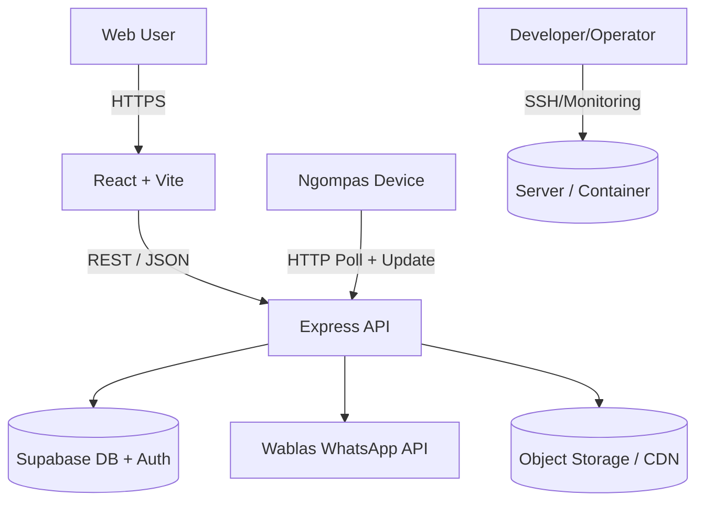
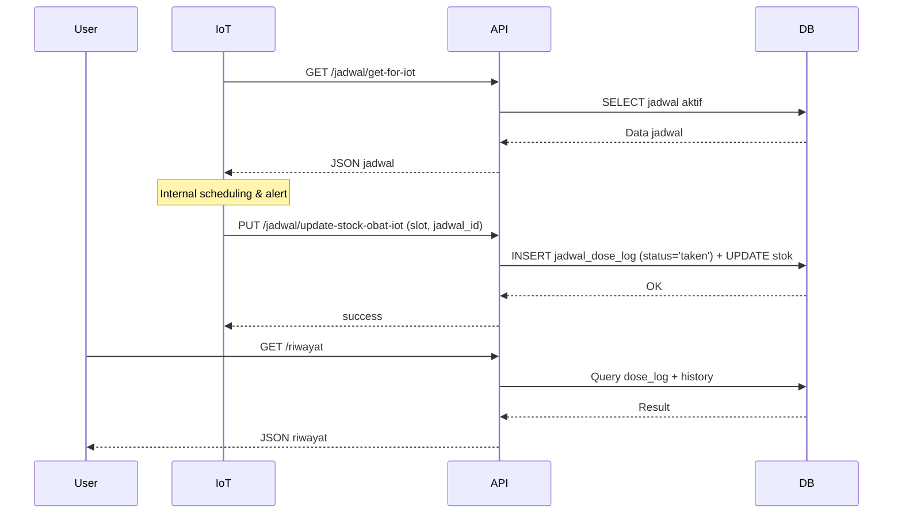
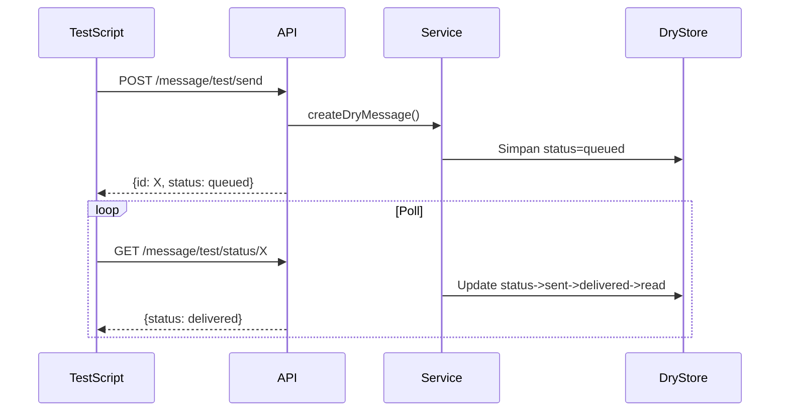
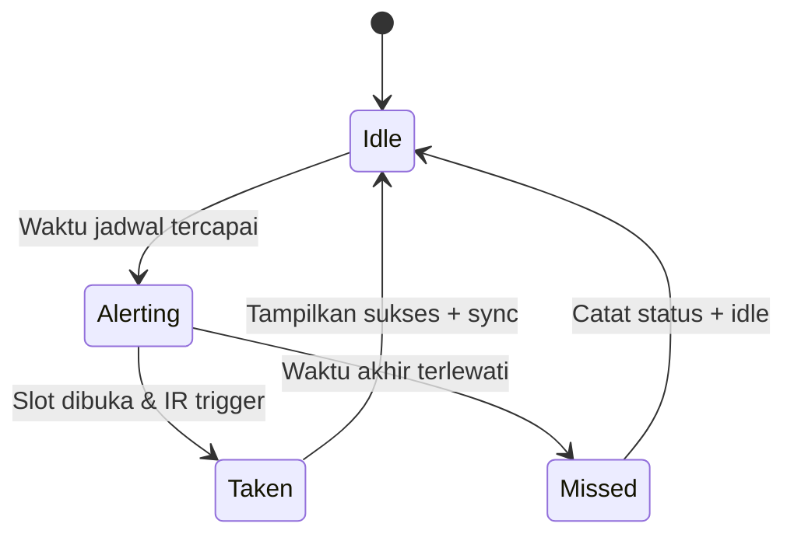

# BUKU TEKNIS SISTEM NGOMBE OBAT (SMEDBOX)

Versi: 1.0  
Tanggal: Oktober 2025  
Status: Draft Teknis (Internal)

---

## 1. RINGKASAN EKSEKUTIF

SmedBox (Ngombe Obat) adalah platform manajemen kepatuhan minum obat terintegrasi yang menggabungkan:

- Aplikasi Web (Frontend) untuk pengguna akhir
- API Backend (Node.js + Supabase) untuk manajemen data dan logika bisnis
- Sistem Notifikasi (WhatsApp / Wablas API)
- Integrasi IoT (Kotak Obat Pintar "Ngompas") dengan sensor dan kontrol otomatis

Tujuan utama: meningkatkan kepatuhan pasien terhadap jadwal obat, memantau stok, dan memfasilitasi pelacakan konsumsi secara otomatis.

---

## 2. TUJUAN DAN RUANG LINGKUP TEKNIS

### 2.1 Tujuan

- Mendokumentasikan arsitektur teknis end-to-end
- Menjadi referensi bagi developer, auditor, dan integrator
- Menyediakan kerangka scaling, keamanan, dan observabilitas

### 2.2 Ruang Lingkup

Mencakup: Frontend, Backend, Database, IoT, Integrasi WA, Keamanan, Deployment, Logging, Monitoring, dan Roadmap Teknis.

### 2.3 Tidak Mencakup

- Kebijakan legal/privasi (lihat dokumen: [PLACEHOLDER LINK PRIVACY POLICY])
- Manual pengguna non-teknis (sudah ada di `manual-pengguna.md`)

---

## 3. ARSITEKTUR SISTEM

### 3.1 Diagram Arsitektur Tingkat Tinggi



### 3.2 Komponen Utama

| Komponen   | Teknologi                                | Fungsi                                               |
| ---------- | ---------------------------------------- | ---------------------------------------------------- |
| Frontend   | React 18, Vite, Tailwind                 | UI / UX aplikasi web pengguna                        |
| Backend    | Node.js 18+, Express                     | API REST, business logic, integrasi eksternal        |
| Database   | Supabase (PostgreSQL)                    | Penyimpanan utama data aplikasi                      |
| Auth       | Supabase Auth (JWT)                      | Manajemen autentikasi & identitas                    |
| Notifikasi | Wablas API                               | Pengiriman reminder WhatsApp                         |
| IoT        | ESP32 + GSM/WiFi + RTC + DFPlayer        | Otomasi fisik pengeluaran obat & pencatatan konsumsi |
| Storage    | (PLACEHOLDER: AWS S3 / Supabase Storage) | Penyimpanan gambar profil / lampiran                 |
| Deployment | (PLACEHOLDER: Docker + VPS / PaaS)       | Menjalankan aplikasi secara produksi                 |
| Monitoring | (PLACEHOLDER: Grafana + Loki / PM2 Logs) | Observabilitas dan logging                           |

### 3.3 Pola Arsitektur

- Layered Architecture pada backend
- Thin client on IoT (state ephemeral + periodic sync)
- Event-driven pseudo pattern (reminder scheduling via WA integration)
- Stateless API (kecuali sesi IoT via token)

---

## 4. FRONTEND TEKNIS

### 4.1 Stack

- React 18 (SPA)
- Vite (development & build bundler)
- Tailwind CSS (utility-first styling)
- React Router (lazy loading routes)
- Supabase JS SDK (auth + data)
- Axios/fetch (wrapper API manual) — file: `frontend/src/api/apiservice.js`

### 4.2 Struktur Direktori (Ringkas)

```
frontend/
  src/
    api/          -> Wrapper API
    components/   -> Komponen UI modular
    hooks/        -> Custom hooks (useApi, dst)
    Page/         -> Halaman utama (lazy loaded)
    routes/       -> Definisi routing
    utils/        -> Helper
    supabaseClient.js -> Inisialisasi klien Supabase
```

### 4.3 Optimasi Performa

- Code splitting via React.lazy + Suspense
- Manual chunk splitting Vite (vendor chunks: react, supabase, axios, date-fns, ui libs)
- Pre-compression: gzip + brotli (plugin: vite-plugin-compression)
- Cache control untuk hashed assets (`immutable, max-age=31536000`)
- Loading fallback komponen (LoadingScreen)

### 4.4 Keamanan Frontend

- Tidak menyimpan token sensitif di localStorage (cek: [PLACEHOLDER])
- CORS dibatasi ke domain produksi (konfigurasi: [PLACEHOLDER])
- Sanitasi input form (manual / library: [PLACEHOLDER])

### 4.5 Potensi Peningkatan

- Implementasi Service Worker (PWA + offline mode) [BACKLOG]
- Prefetch route penting setelah idle [BACKLOG]
- Integrasi Sentry untuk error tracking [BACKLOG]

---

## 5. BACKEND TEKNIS

### 5.1 Stack

- Node.js + Express
- Middleware utama:
  - compression (gzip brotli negotiation)
  - upload (multer / custom?) [PLACEHOLDER: confirm library]
  - auth JWT verifikasi Supabase
  - errorHandler custom

### 5.2 Struktur Direktori (Ringkas)

```
backend/src/
  index.js            -> Entry point
  config/             -> Supabase client init
  controllers/        -> Logika request level
  services/           -> Business logic
  middleware/         -> Auth, error, upload
  routes/             -> Definisi endpoint
  k6/                 -> Skrip load & latency testing
```

### 5.3 Pola Desain Backend

- Controller → Service → External (Supabase / Wablas)
- No direct DB SQL di controller (abstraksi service) [CHECK]
- Error propagation via next(err) + centralized handler

### 5.4 Modul Utama

| Modul              | Fungsi                            | File Kunci                                                              |
| ------------------ | --------------------------------- | ----------------------------------------------------------------------- |
| Auth / Signin      | Login user                        | `signinService.js`, `signinController.js`                               |
| Jadwal Obat        | CRUD jadwal + stok + WA reminder  | `jadwalService.js`, `reminderService.js`                                |
| Kontrol Dokter     | CRUD + WA schedule                | `controlService.js`, `controlScheduleService.js`                        |
| Catatan            | Catatan kesehatan                 | `notesService.js`                                                       |
| Riwayat / Dose Log | Pencatatan konsumsi               | `doseLogService.js`, `historyService.js`                                |
| Peringatan         | Info tambahan terkait jadwal      | `peringatanService.js`                                                  |
| WhatsApp           | Pengiriman pesan/dry-run + status | `wablasService.js`, `messageService.js`                                 |
| IoT Bridge         | Endpoint stok/jadwal IoT          | `waReminderService.js`, `wablasScheduleService.js` [PLACEHOLDER verify] |

### 5.5 Integrasi WhatsApp (Wablas)

- Mode normal: kirim pesan realtime / scheduling via Wablas API
- Mode dry-run (testing): Simulasi status (queued → sent → delivered → read)
- Endpoint tambahan: `/v1/api/message/test/*`
- Status polling: GET `/status/:messageId`

### 5.6 K6 Load & Latency Testing

Skrip tersedia di `backend/k6/`:

- `all-apis.js` → Regression + CRUD flow + cleanup
- `important-apis.js` → Subset endpoint kritikal
- `wa-latency-50.js` → 50x simulasi WA send/delivery latency (dry-run)
- Metrics spesifik: `wa_send_latency_ms`, `wa_delivery_latency_ms`

### 5.7 Error Handling Standar

Format JSON:

```json
{
  "success": false,
  "message": "<error_message>",
  "code": "<optional_code>",
  "details": { "...": "..." }
}
```

[PLACEHOLDER: contoh nyata response error dari service]

### 5.8 Logging

Saat ini: console.log (leveling sederhana)  
Rencana: Integrasi structured logging (pino/winston) + traceId [BACKLOG]

---

## 6. DATABASE & DATA MODEL

### 6.1 Engine & Layanan

- Supabase (PostgreSQL 14+)
- Fitur digunakan: Auth (users), Row Level Security (RLS) [PLACEHOLDER confirm], Storage (optional)

### 6.2 Entitas Utama

| Tabel                | Deskripsi                                 | Relasi             |
| -------------------- | ----------------------------------------- | ------------------ |
| profile              | Data profil user (nama, no_hp, email)     | FK → auth.users    |
| jadwal               | Jadwal obat inti                          | FK → profile, user |
| jadwal_dose_log      | Status konsumsi per dosis per waktu       | FK → jadwal, user  |
| jadwal_wa_reminders  | Konfigurasi WA per jadwal                 | FK → jadwal, user  |
| kontrol              | Jadwal kontrol dokter                     | FK → profile, user |
| kontrol_wa_reminders | WA reminder kontrol                       | FK → kontrol, user |
| notes                | Catatan kesehatan                         | FK → profile, user |
| history              | Riwayat konsumsi & stok (legacy/combined) | FK → profile, user |
| peringatan           | Catatan tambahan per jadwal/slot          | FK → profile, user |

### 6.3 Skema (Referensi)

(Lihat file: `backend/database/supabse.sql`)

### 6.4 Indeks Penting

- `idx_jdl_user_date` → optimasi query dosis per hari
- `idx_jdl_jadwal_date` → optimasi filter jadwal per jadwal_id + tanggal

### 6.5 View Operasional

`public.jadwal_status_today` → Menampilkan status konsolidasi setiap dosis jadwal untuk hari ini.

### 6.6 Data Flow Konsumsi Obat



### 6.7 Retensi Data

| Kategori        | Periode Simpan                  | Kebijakan Hapus            |
| --------------- | ------------------------------- | -------------------------- |
| jadwal          | Aktif + arsip                   | Manual delete user         |
| jadwal_dose_log | >= 24 bulan                     | [PLACEHOLDER KEBIJAKAN]    |
| history         | Legacy referensi                | Bisa dipadatkan (batch)    |
| notes           | Sampai dihapus user             | Hard delete                |
| kontrol         | Setelah selesai tetap tersimpan | Optional archive [BACKLOG] |

### 6.8 Potensi Migrasi

- Konsolidasi `history` dan `jadwal_dose_log` (deprecate `history` untuk konsumsi) [BACKLOG]
- Tambah tabel `device_binding` untuk multi perangkat IoT [BACKLOG]

---

## 7. INTEGRASI WHATSAPP (WABLAS)

### 7.1 Use Case

| Use Case                | Pemicu                 | Contoh Pesan                                              |
| ----------------------- | ---------------------- | --------------------------------------------------------- |
| Reminder jadwal obat    | Jam konsumsi tiba      | "Halo [Nama], waktunya minum [Obat] [Dosis]"              |
| Reminder kontrol dokter | H-1 / H-H jam tertentu | "Pengingat kontrol besok dengan dr. [Nama] pukul [Waktu]" |
| Stok rendah             | Stok < ambang (7 hari) | "Stok [Obat] tinggal [Sisa], segera isi ulang."           |

### 7.2 Mode Operasi

- Real Mode: Kirim via API Wablas
- Dry Run: Simulasi in-memory (no external call) untuk k6/warm testing

### 7.3 Alur Pengiriman (Dry-Run)



### 7.4 Rate Limiting

[PLACEHOLDER: Jika ada pembatasan Wablas atau internal throttle]

### 7.5 Monitoring

- Latency metrik via k6: `wa_send_latency_ms` dan `wa_delivery_latency_ms`
- Simpan hasil uji di: [PLACEHOLDER PATH HASIL K6]

---

## 8. PERANGKAT IOT (NGOMPAS)

### 8.1 Hardware Spesifikasi

| Komponen    | Tipe                    | Fungsi                   |
| ----------- | ----------------------- | ------------------------ |
| MCU         | ESP32-WROOM             | CPU + WiFi + Bluetooth   |
| GSM Module  | SIM800L (TinyGSM)       | Koneksi seluler cadangan |
| RTC         | DS3231                  | Waktu presisi (offline)  |
| IO Expander | PCF8575                 | Kontrol 6 LED slot       |
| Sensor      | IR per slot (6x)        | Deteksi pengambilan obat |
| Audio       | DFPlayer Mini + Speaker | Audio pengingat          |
| Display     | TFT (TFT_eSPI)          | UI status perangkat      |
| Buzzer      | Aktif                   | Pengingat bunyi          |
| Battery     | Li-Ion + ADC monitoring | Mobilitas                |

### 8.2 Software Stack (Firmware)

- Bahasa: C++ (Arduino Core ESP32)
- Library kunci: WiFiManager, TinyGSM, ArduinoJson, Preferences, PCF8575, DFPlayer, RTClib
- Mode operasi: WiFi → fallback GSM

### 8.3 Data yang Disinkronkan

| Arah      | Endpoint          | Payload                     | Frekuensi               |
| --------- | ----------------- | --------------------------- | ----------------------- |
| IoT → API | update stok (PUT) | {slot, jadwal_id, taken_at} | Saat obat diambil       |
| IoT → API | dose log          | (implicit via stok update)  | Event-based             |
| API → IoT | jadwal aktif      | List jadwal + jam           | Setiap 5 menit / reboot |

### 8.4 State Machine (Sederhana)



### 8.5 Keamanan Perangkat

| Risiko              | Mitigasi                                       |
| ------------------- | ---------------------------------------------- |
| Unauthorized config | WiFiManager reset protected by physical button |
| Token bocor         | Simpan token hanya di Preferences (flash)      |
| Replay stok update  | Server validasi jadwal_id & user_id            |
| Manipulasi waktu    | RTC + sync NTP (WiFi) + log perbedaan          |

### 8.6 Firmware Update

[PLACEHOLDER: Mekanisme OTA / Manual via USB / Belum Ada]

### 8.7 Logging Perangkat

| Level | Output                               |
| ----- | ------------------------------------ |
| INFO  | Serial (115200)                      |
| ERROR | Serial + layar error (jika kritikal) |
| DEBUG | [PLACEHOLDER toggle build flag]      |

---

## 9. KEAMANAN (SECURITY)

### 9.1 Autentikasi & Otorisasi

- Menggunakan Supabase JWT (Bearer token)
- Middleware verifikasi: `verifySupabaseJWT.js`
- Role: [PLACEHOLDER: Apakah ada admin vs user?] → Middleware `requireAdmin.js`

### 9.2 Validasi Data

| Layer    | Mekanisme                                  |
| -------- | ------------------------------------------ |
| Frontend | Basic form validation (client)             |
| Backend  | Service-level validation (manual)          |
| DB       | Tipe data + foreign key + constraint check |

### 9.3 Transport Security

- HTTPS dianjurkan (Production) — [PLACEHOLDER sertifikat & terminasi TLS]
- IoT → API: HTTP (disarankan upgrade ke HTTPS) [BACKLOG]

### 9.4 Proteksi API

| Risiko            | Mitigasi                                   |
| ----------------- | ------------------------------------------ |
| Brute force login | [PLACEHOLDER: rate limiter signin]         |
| Spam WA reminder  | Internal schedule + throttle [PLACEHOLDER] |
| Payload besar     | body-parser size limit [PLACEHOLDER nilai] |
| CORS abuse        | Whitelist domain produksi [PLACEHOLDER]    |

### 9.5 Data Sensitif

| Data         | Perlakuan                                   |
| ------------ | ------------------------------------------- |
| Password     | Ditangani Supabase (hashed)                 |
| Token JWT    | Header Authorization (tidak disimpan di DB) |
| Nomor WA     | Plain text (pertimbangkan masking)          |
| Riwayat obat | Protected (FK user)                         |

---

## 10. DEPLOYMENT & INFRASTRUKTUR

### 10.1 Target Lingkungan

| Environment | Tujuan           | Domain                        |
| ----------- | ---------------- | ----------------------------- |
| Development | Internal dev     | localhost                     |
| Staging     | Uji pre-produksi | [PLACEHOLDER]                 |
| Production  | Live app         | [PLACEHOLDER domain produksi] |

### 10.2 Metode Deployment

| Komponen | Metode                           | Catatan               |
| -------- | -------------------------------- | --------------------- |
| Frontend | Build → upload ke static hosting | CDN + cache immutable |
| Backend  | Docker container / Node PM2      | Rolling restart       |
| Database | Supabase managed                 | Backup otomatis       |
| IoT      | Manual flash firmware            | OTA [BACKLOG]         |

### 10.3 Dependensi Runtime

| Layer      | Tools                               |
| ---------- | ----------------------------------- | -------------- |
| Backend    | Node 18+, npm dependencies          | `package.json` |
| Frontend   | Node + Vite build                   | dist artifacts |
| Monitoring | [PLACEHOLDER: PM2 / Grafana / Loki] |                |

### 10.4 CI/CD (Rencana)

- Pipeline build & test otomatis (GitHub Actions) [BACKLOG]
- Lint + k6 smoke test sebelum deploy [BACKLOG]

---

## 11. OBSERVABILITY

### 11.1 Logging

| Layer            | Teknologi               | Status  |
| ---------------- | ----------------------- | ------- |
| Backend          | console.log             | CURRENT |
| Backend (future) | Winston/Pino + JSON log | BACKLOG |
| IoT              | Serial log              | CURRENT |

### 11.2 Monitoring

| Area | Indikator                       | Status            |
| ---- | ------------------------------- | ----------------- |
| API  | Latency p95, error rate         | BACKLOG           |
| WA   | Delivery success %, avg latency | Partial via k6    |
| IoT  | Online/offline heartbeat        | BACKLOG           |
| DB   | Connection usage, slow query    | Supabase internal |

### 11.3 Alerting (Rencana)

| Kondisi               | Notifikasi     |
| --------------------- | -------------- |
| WA delivery fail > X% | Email dev team |
| API error rate > Y%   | Slack channel  |
| IoT offline > 1 jam   | Push ke owner  |

---

## 12. PENGUJIAN

### 12.1 Jenis Pengujian

| Tipe              | Status         | Tool                           |
| ----------------- | -------------- | ------------------------------ |
| Unit Test Backend | [PLACEHOLDER]  | Jest/Mocha (belum)             |
| Integration Test  | [PLACEHOLDER]  | Supertest (rencana)            |
| Load Test         | DONE sebagian  | k6                             |
| Latency WA        | DONE (dry-run) | k6 script wa-latency-50.js     |
| E2E UI            | [PLACEHOLDER]  | Playwright (screenshot script) |

### 12.2 KPI Teknis (Target)

| Indikator           | Target                         | Catatan                      |
| ------------------- | ------------------------------ | ---------------------------- |
| TTFB API            | < 300ms                        | Endpoint non-IO heavy        |
| Bundle JS initial   | < 300KB gzip                   | Sudah dicapai (vendor split) |
| WA reminder latency | < 5s (real), < 500ms (dry-run) | Monitoring via k6            |
| IoT sync jadwal     | < 10s dari jadwal baru         | Periodic fetch 5 menit       |

---

## 13. RISIKO & MITIGASI

| Risiko                   | Dampak                 | Mitigasi                                      |
| ------------------------ | ---------------------- | --------------------------------------------- |
| Downstream Wablas down   | Reminder gagal         | Retry + fallback notif manual                 |
| Supabase outage          | Semua fungsi terganggu | Backup read-only mode [BACKLOG]               |
| IoT clock drift          | Jadwal alert meleset   | NTP sync WiFi + RTC battery                   |
| Token bocor di perangkat | Penyalahgunaan API     | Scope minimal, ability revoke token [BACKLOG] |
| Stok double decrement    | Data salah             | Idempotency key update stok [BACKLOG]         |

---

## 14. ROADMAP TEKNIS (6–12 BULAN)

| Prioritas | Fitur                     | Deskripsi                             |
| --------- | ------------------------- | ------------------------------------- |
| HIGH      | Structured Logging        | Pino + traceId untuk korelasi request |
| HIGH      | WA Delivery Tracking Real | Persist status real Wablas            |
| HIGH      | OTA Firmware IoT          | Update jarak jauh                     |
| MED       | Export Data (PDF/Excel)   | Ekspor jadwal & riwayat               |
| MED       | Multi-User Caregiver      | 1 akun → multiple pasien              |
| MED       | Advanced Reminder Offset  | X menit sebelum jadwal                |
| LOW       | PWA Offline Support       | Cache jadwal & catatan lokal          |
| LOW       | Anomali Detection         | Notifikasi ketidakpatuhan pola        |

---

## 15. LAMPIRAN

### 15.1 Daftar Endpoint (Ringkas)

| Method | Endpoint                      | Deskripsi             | Auth              |
| ------ | ----------------------------- | --------------------- | ----------------- |
| POST   | /signin                       | Login                 | No                |
| GET    | /profile                      | Get profil            | Yes               |
| PUT    | /profile                      | Update profil         | Yes               |
| GET    | /jadwal                       | List jadwal           | Yes               |
| POST   | /jadwal                       | Buat jadwal           | Yes               |
| PUT    | /jadwal/:id                   | Update jadwal         | Yes               |
| DELETE | /jadwal/:id                   | Hapus jadwal          | Yes               |
| PUT    | /jadwal/update-stock-obat-iot | Update stok via IoT   | Yes               |
| GET    | /history                      | List history          | Yes               |
| GET    | /dose-log/today               | Status dosis hari ini | Yes [PLACEHOLDER] |
| POST   | /notes                        | Buat catatan          | Yes               |
| DELETE | /notes/:id                    | Hapus catatan         | Yes               |
| POST   | /message/send                 | Kirim WA              | Yes               |
| POST   | /message/test/send            | Kirim (dry-run)       | No                |
| GET    | /message/status/:id           | Status WA             | Yes               |
| GET    | /message/test/status/:id      | Status WA dry-run     | No                |
| GET    | /kontrol                      | List kontrol          | Yes               |
| POST   | /kontrol                      | Buat kontrol          | Yes               |

[PLACEHOLDER: Lengkapi daftar endpoint penuh]

### 15.2 Variabel Lingkungan (ENV)

| Nama                 | Deskripsi            | Contoh                       |
| -------------------- | -------------------- | ---------------------------- |
| PORT                 | Port backend         | 5000                         |
| SUPABASE_URL         | URL Supabase         | https://xxxx.supabase.co     |
| SUPABASE_ANON_KEY    | Public anon key      | (string)                     |
| SUPABASE_SERVICE_KEY | Service key (server) | (string)                     |
| WABLAS_API_KEY       | API key Wablas       | (string)                     |
| WABLAS_BASE_URL      | Base URL Wablas      | https://jogja.wablas.com/api |
| WABLAS_DRY_RUN       | Aktifkan simulasi    | 1/0                          |
| SERVE_FRONTEND       | Serve SPA dist/      | true/false                   |

### 15.3 Konvensi Penamaan

| Area        | Konvensi                          |
| ----------- | --------------------------------- | ------------------- |
| File JS     | camelCase / kebab-case untuk util | `doseLogService.js` |
| Variabel DB | snake_case                        | `jadwal_dose_log`   |
| ID          | UUID v4                           | `id`, `note_id`     |

### 15.4 Glossary Teknis

| Istilah  | Definisi                                |
| -------- | --------------------------------------- |
| Dose Log | Catatan per-event konsumsi obat         |
| Dry-Run  | Mode simulasi tanpa eksternal API nyata |
| Slot     | Lokasi fisik obat di perangkat IoT      |
| Reminder | Pesan WA terjadwal otomatis             |

---

## 16. STATUS DOKUMEN

Bagian bertanda [PLACEHOLDER] akan diisi setelah konfirmasi operasional & keputusan arsitektural lanjutan.

Owner Dokumen: [PLACEHOLDER NAMA OWNER TEKNIS]  
Last Review: [PLACEHOLDER TANGGAL REVIEW TERAKHIR]

---

**© 2025 SmedBox / Ngombe Obat. Internal Technical Use Only.**
