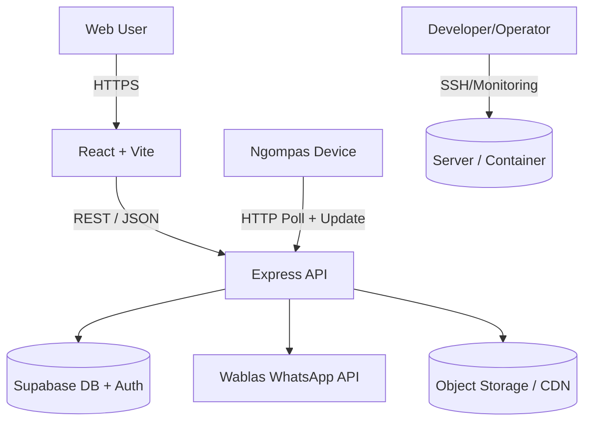
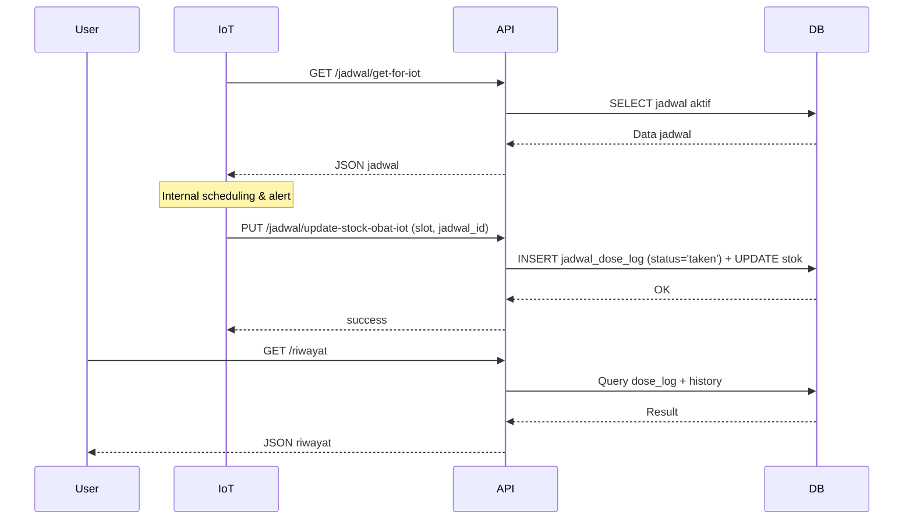
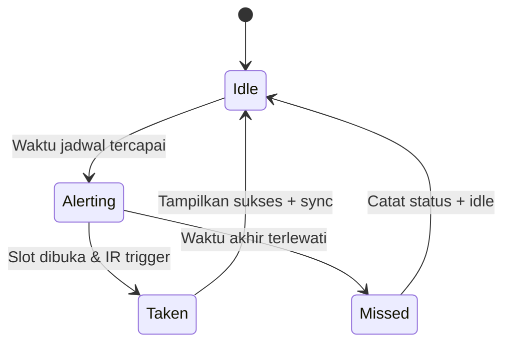
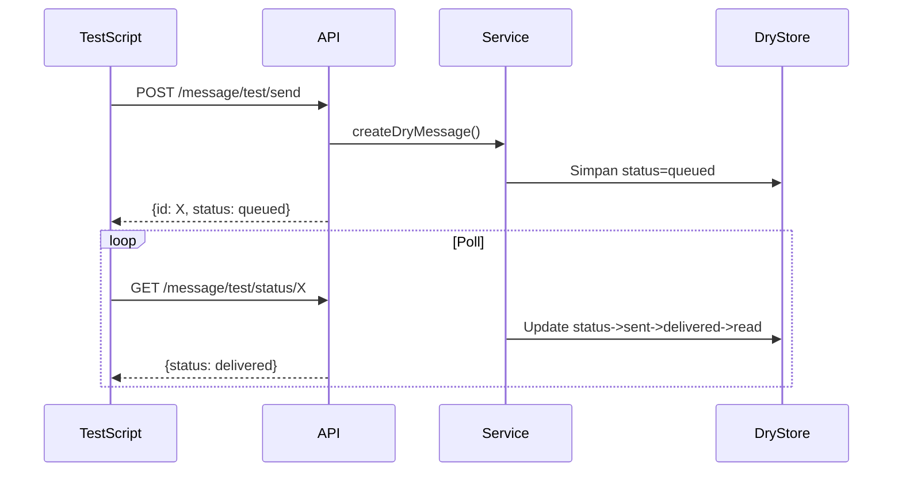

# DOKUMENTASI LENGKAP SISTEM NGOMBE OBAT (SMEDBOX)

Versi: 1.0  
Tanggal: Oktober 2025  
Status: Draft Komprehensif (Internal)

---

## Daftar Isi

1. [Ringkasan Eksekutif](#1-ringkasan-eksekutif)
2. [Arsitektur Sistem](#2-arsitektur-sistem)
3. [Frontend (Aplikasi Web)](#3-frontend-aplikasi-web)
   - [3.1 Spesifikasi Teknis Frontend](#31-spesifikasi-teknis-frontend)
   - [3.2 Panduan Pengguna Aplikasi Web](#32-panduan-pengguna-aplikasi-web)
4. [Backend (API Server)](#4-backend-api-server)
5. [Database & Data Model](#5-database--data-model)
6. [Desain Fisik & Perangkat Keras (Ngompas)](#6-desain-fisik--perangkat-keras-ngompas)
   - [6.1 Spesifikasi Desain Fisik](#61-spesifikasi-desain-fisik)
   - [6.2 Dimensi & Layout](#62-dimensi--layout)
   - [6.3 Material & Komponen Eksternal](#63-material--komponen-eksternal)
   - [6.4 Diagram Sirkuit & PCB](#64-diagram-sirkuit--pcb)
   - [6.5 Proses Perakitan (Assembly)](#65-proses-perakitan-assembly)
   - [6.6 Bill of Materials (BOM)](#66-bill-of-materials-bom)
7. [Perangkat IoT (Firmware Ngompas)](#7-perangkat-iot-firmware-ngompas)
   - [7.1 Spesifikasi Teknis Firmware](#71-spesifikasi-teknis-firmware)
   - [7.2 Panduan Pengguna Perangkat IoT](#72-panduan-pengguna-perangkat-iot)
8. [Integrasi WhatsApp (Wablas)](#8-integrasi-whatsapp-wablas)
9. [Keamanan (Security)](#9-keamanan-security)
10. [Deployment & Infrastruktur](#10-deployment--infrastruktur)
11. [Observability (Monitoring & Logging)](#11-observability-monitoring--logging)
12. [Pengujian](#12-pengujian)
13. [Risiko & Mitigasi](#13-risiko--mitigasi)
14. [Roadmap Teknis](#14-roadmap-teknis)
15. [Lampiran](#15-lampiran)

---

## 1. RINGKASAN EKSEKUTIF

SmedBox (Ngombe Obat) adalah platform manajemen kepatuhan minum obat terintegrasi yang menggabungkan:

- Aplikasi Web (Frontend) untuk pengguna akhir
- API Backend (Node.js + Supabase) untuk manajemen data dan logika bisnis
- Sistem Notifikasi (WhatsApp / Wablas API)
- Integrasi IoT (Kotak Obat Pintar "Ngompas") dengan sensor dan kontrol otomatis

Tujuan utama: meningkatkan kepatuhan pasien terhadap jadwal obat, memantau stok, dan memfasilitasi pelacakan konsumsi secara otomatis.

---

## 2. ARSITEKTUR SISTEM

### 2.1 Diagram Arsitektur Tingkat Tinggi



### 2.2 Komponen Utama

| Komponen   | Teknologi                                | Fungsi                                               |
| ---------- | ---------------------------------------- | ---------------------------------------------------- |
| Frontend   | React 18, Vite, Tailwind                 | UI / UX aplikasi web pengguna                        |
| Backend    | Node.js 18+, Express                     | API REST, business logic, integrasi eksternal        |
| Database   | Supabase (PostgreSQL)                    | Penyimpanan utama data aplikasi                      |
| Auth       | Supabase Auth (JWT)                      | Manajemen autentikasi & identitas                    |
| Notifikasi | Wablas API                               | Pengiriman reminder WhatsApp                         |
| IoT        | ESP32 + GSM/WiFi + RTC + DFPlayer        | Otomasi fisik pengeluaran obat & pencatatan konsumsi |
| Storage    | (PLACEHOLDER: AWS S3 / Supabase Storage) | Penyimpanan gambar profil / lampiran                 |
| Deployment | (PLACEHOLDER: Docker + VPS / PaaS)       | Menjalankan aplikasi secara produksi                 |
| Monitoring | (PLACEHOLDER: Grafana + Loki / PM2 Logs) | Observabilitas dan logging                           |

### 2.3 Pola Arsitektur

- Layered Architecture pada backend
- Thin client on IoT (state ephemeral + periodic sync)
- Event-driven pseudo pattern (reminder scheduling via WA integration)
- Stateless API (kecuali sesi IoT via token)

---

## 3. FRONTEND (APLIKASI WEB)

### 3.1 Spesifikasi Teknis Frontend

#### 3.1.1 Stack

- React 18 (SPA)
- Vite (development & build bundler)
- Tailwind CSS (utility-first styling)
- React Router (lazy loading routes)
- Supabase JS SDK (auth + data)
- Axios/fetch (wrapper API manual) — file: `frontend/src/api/apiservice.js`

#### 3.1.2 Struktur Direktori (Ringkas)

```
frontend/
  src/
    api/          -> Wrapper API
    components/   -> Komponen UI modular
    hooks/        -> Custom hooks (useApi, dst)
    Page/         -> Halaman utama (lazy loaded)
    routes/       -> Definisi routing
    utils/        -> Helper
    supabaseClient.js -> Inisialisasi klien Supabase
```

#### 3.1.3 Optimasi Performa

- Code splitting via React.lazy + Suspense
- Manual chunk splitting Vite (vendor chunks: react, supabase, axios, date-fns, ui libs)
- Pre-compression: gzip + brotli (plugin: vite-plugin-compression)
- Cache control untuk hashed assets (`immutable, max-age=31536000`)
- Loading fallback komponen (LoadingScreen)

#### 3.1.4 Keamanan Frontend

- Tidak menyimpan token sensitif di localStorage (cek: [PLACEHOLDER])
- CORS dibatasi ke domain produksi (konfigurasi: [PLACEHOLDER])
- Sanitasi input form (manual / library: [PLACEHOLDER])

#### 3.1.5 Potensi Peningkatan

- Implementasi Service Worker (PWA + offline mode) [BACKLOG]
- Prefetch route penting setelah idle [BACKLOG]
- Integrasi Sentry untuk error tracking [BACKLOG]

---

### 3.2 Panduan Pengguna Aplikasi Web

#### 3.2.1 Memulai

**1. Registrasi**

1. Klik **"Daftar"** di halaman login
2. Isi data: Email, Password, Nama, Nomor WhatsApp
3. Klik **"Daftar"** & cek email untuk verifikasi

**2. Login**

1. Masukkan email dan password
2. Klik **"Login"**

**3. Lupa Password**

1. Klik **"Lupa Password?"**
2. Masukkan email, lalu cek email untuk link reset

**[GAMBAR: Halaman login, registrasi, dan reset password]**

---

#### 3.2.2 Fitur Utama

**Dashboard**
Tampilan ringkasan setelah login: Jadwal hari ini, kontrol mendatang, status stok, statistik, dan catatan terbaru.

**[GAMBAR: Dashboard dengan semua widget]**

**Jadwal Obat**

- **Tambah Jadwal**: Klik "Tambah Jadwal", isi form (nama obat, dosis, stok, slot, jam minum, reminder), lalu "Simpan".
- **Edit/Hapus**: Gunakan tombol pada card jadwal.
- **Update Stok**: Klik "Update Stok" pada card, masukkan jumlah baru.

**[GAMBAR: Form tambah jadwal dan daftar jadwal]**

**Kontrol Dokter**

- **Tambah Kontrol**: Klik "Tambah Kontrol", isi form (pasien, tanggal, waktu, dokter, reminder), lalu "Simpan".
- **Aksi**: Tandai "Selesai" atau "Edit" dari card kontrol.

**[GAMBAR: Daftar jadwal kontrol]**

**Catatan**

- **Tambah Catatan**: Klik "Tambah Catatan", pilih kategori, isi pesan, lalu "Simpan".
- **Cari & Statistik**: Gunakan search box atau klik tab "Statistik".

**[GAMBAR: Halaman catatan dengan search dan stats]**

**Riwayat**

- Melihat rekam jejak konsumsi obat (Diminum/Terlewat).
- Filter berdasarkan rentang waktu.
- Tambah riwayat manual jika lupa mencatat.

**[GAMBAR: Halaman riwayat dengan filter]**

---

#### 3.2.3 Pengaturan & Profil

**Edit Profil**

1. Klik menu **"Profil"** → **"Edit Profil"**
2. Ubah nama atau nomor WhatsApp, lalu "Simpan".

**Ganti Password**

1. Klik **"Ganti Password"** di halaman Profil.
2. Isi password lama dan baru, lalu "Ubah Password".

**[GAMBAR: Form edit profil dan ganti password]**

---

#### 3.2.4 FAQ & Troubleshooting Web

| Masalah                     | Solusi                                                     |
| --------------------------- | ---------------------------------------------------------- |
| **Tidak bisa login**        | Cek email/password, verifikasi akun, atau reset password.  |
| **Halaman lambat**          | Cek koneksi internet, refresh (Ctrl+F5), clear cache.      |
| **Reminder WA tidak masuk** | Cek nomor WA di profil, pastikan reminder aktif di jadwal. |
| **Data tidak muncul**       | Refresh halaman, cek filter aktif, atau hubungi support.   |

---

## 4. BACKEND (API SERVER)

### 4.1 Stack

- Node.js + Express
- Middleware utama:
  - compression (gzip brotli negotiation)
  - upload (multer / custom?) [PLACEHOLDER: confirm library]
  - auth JWT verifikasi Supabase
  - errorHandler custom

### 4.2 Struktur Direktori (Ringkas)

```
backend/src/
  index.js            -> Entry point
  config/             -> Supabase client init
  controllers/        -> Logika request level
  services/           -> Business logic
  middleware/         -> Auth, error, upload
  routes/             -> Definisi endpoint
  k6/                 -> Skrip load & latency testing
```

### 4.3 Pola Desain Backend

- Controller → Service → External (Supabase / Wablas)
- No direct DB SQL di controller (abstraksi service) [CHECK]
- Error propagation via next(err) + centralized handler

### 4.4 Modul Utama

| Modul              | Fungsi                            | File Kunci                                                              |
| ------------------ | --------------------------------- | ----------------------------------------------------------------------- |
| Auth / Signin      | Login user                        | `signinService.js`, `signinController.js`                               |
| Jadwal Obat        | CRUD jadwal + stok + WA reminder  | `jadwalService.js`, `reminderService.js`                                |
| Kontrol Dokter     | CRUD + WA schedule                | `controlService.js`, `controlScheduleService.js`                        |
| Catatan            | Catatan kesehatan                 | `notesService.js`                                                       |
| Riwayat / Dose Log | Pencatatan konsumsi               | `doseLogService.js`, `historyService.js`                                |
| Peringatan         | Info tambahan terkait jadwal      | `peringatanService.js`                                                  |
| WhatsApp           | Pengiriman pesan/dry-run + status | `wablasService.js`, `messageService.js`                                 |
| IoT Bridge         | Endpoint stok/jadwal IoT          | `waReminderService.js`, `wablasScheduleService.js` [PLACEHOLDER verify] |

### 4.5 Error Handling Standar

Format JSON:

```json
{
  "success": false,
  "message": "<error_message>",
  "code": "<optional_code>",
  "details": { "...": "..." }
}
```

[PLACEHOLDER: contoh nyata response error dari service]

### 4.6 Logging

Saat ini: console.log (leveling sederhana)  
Rencana: Integrasi structured logging (pino/winston) + traceId [BACKLOG]

---

## 5. DATABASE & DATA MODEL

### 5.1 Engine & Layanan

- Supabase (PostgreSQL 14+)
- Fitur digunakan: Auth (users), Row Level Security (RLS) [PLACEHOLDER confirm], Storage (optional)

### 5.2 Entitas Utama

| Tabel                | Deskripsi                                 | Relasi             |
| -------------------- | ----------------------------------------- | ------------------ |
| profile              | Data profil user (nama, no_hp, email)     | FK → auth.users    |
| jadwal               | Jadwal obat inti                          | FK → profile, user |
| jadwal_dose_log      | Status konsumsi per dosis per waktu       | FK → jadwal, user  |
| jadwal_wa_reminders  | Konfigurasi WA per jadwal                 | FK → jadwal, user  |
| kontrol              | Jadwal kontrol dokter                     | FK → profile, user |
| kontrol_wa_reminders | WA reminder kontrol                       | FK → kontrol, user |
| notes                | Catatan kesehatan                         | FK → profile, user |
| history              | Riwayat konsumsi & stok (legacy/combined) | FK → profile, user |
| peringatan           | Catatan tambahan per jadwal/slot          | FK → profile, user |

### 5.3 Skema (Referensi)

(Lihat file: `backend/database/supabse.sql`)

### 5.4 Indeks Penting

- `idx_jdl_user_date` → optimasi query dosis per hari
- `idx_jdl_jadwal_date` → optimasi filter jadwal per jadwal_id + tanggal

### 5.5 View Operasional

`public.jadwal_status_today` → Menampilkan status konsolidasi setiap dosis jadwal untuk hari ini.

### 5.6 Data Flow Konsumsi Obat



---

## 6. DESAIN FISIK & PERANGKAT KERAS (NGOMPAS)

Bagian ini mendokumentasikan desain fisik dari kotak obat pintar "Ngompas".

### 6.1 Spesifikasi Desain Fisik

- **Konsep Desain**: [PLACEHOLDER: Minimalis, portabel, user-friendly, dengan akses mudah ke slot obat dan display yang jelas terlihat].
- **Target Pengguna**: [PLACEHOLDER: Lansia, pasien dengan jadwal kompleks, caregiver].
- **Fitur Fisik Utama**:
  - 6 Kompartemen/Slot obat individual.
  - Display TFT berwarna untuk status.
  - Tombol fisik untuk interaksi dasar (Power, Reset WiFi).
  - Port USB-C untuk pengisian daya.
  - Indikator LED per slot.

### 6.2 Dimensi & Layout

- **Dimensi Keseluruhan (P x L x T)**: [PLACEHOLDER: misal, 25cm x 15cm x 8cm].
- **Dimensi per Slot (P x L x T)**: [PLACEHOLDER: misal, 5cm x 4cm x 6cm, cukup untuk ~30 tablet ukuran standar].
- **Berat**: [PLACEHOLDER: misal, ~800 gram dengan baterai].
- **Layout Internal**: [PLACEHOLDER: Diagram atau deskripsi posisi PCB utama, baterai, speaker, dan mekanisme slot].

**[GAMBAR: Sketsa desain 3D atau gambar teknik dengan dimensi]**

### 6.3 Material & Komponen Eksternal

- **Material Casing/Box**: [PLACEHOLDER: misal, ABS (Acrylonitrile Butadiene Styrene) 3D Printed, atau Injection Molded Plastic].
- **Tutup Slot**: [PLACEHOLDER: misal, Akrilik transparan atau material sama dengan body].
- **Display Cover**: [PLACEHOLDER: misal, Lapisan akrilik pelindung].
- **Kaki/Base**: [PLACEHOLDER: misal, Karet anti-slip].

### 6.4 Diagram Sirkuit & PCB

- **Diagram Skematik**: [PLACEHOLDER: Link ke file Eagle/KiCad/PDF atau gambar skematik sirkuit yang menghubungkan ESP32, SIM800L, DS3231, PCF8575, DFPlayer, sensor IR, dan komponen lainnya].
- **Desain PCB Layout**: [PLACEHOLDER: Link ke file Gerber atau gambar layout PCB (Top & Bottom layer)].
- **Versi PCB**: [PLACEHOLDER: misal, Ngompas_PCB_v2.1].

**[GAMBAR: Screenshot diagram skematik dan layout PCB]**

### 6.5 Proses Perakitan (Assembly)

1. **Persiapan Casing**: [PLACEHOLDER: misal, Cetak 3D bagian atas, bawah, dan 6 tutup slot].
2. **Pemasangan Komponen Eksternal**:
   - Pasang display TFT ke casing depan.
   - Pasang tombol Power dan Reset.
   - Pasang port USB-C.
3. **Instalasi PCB & Sensor**:
   - Pasang PCB utama di base casing.
   - Pasang 6 sensor IR di setiap slot.
   - Pasang 6 LED di setiap slot.
4. **Koneksi Kabel (Wiring)**:
   - Sambungkan baterai ke PCB.
   - Sambungkan speaker ke DFPlayer di PCB.
   - Sambungkan sensor dan LED ke header pin di PCB.
5. **Perakitan Akhir**:
   - Pasang tutup slot.
   - Satukan casing atas dan bawah, kencangkan dengan baut.
   - Tempelkan kaki karet.
6. **Uji Fungsional**: Lakukan pengujian semua komponen (LED, buzzer, sensor, display) sebelum flashing firmware.

**[GAMBAR: Foto langkah-langkah perakitan]**

### 6.6 Bill of Materials (BOM)

| Kategori       | Komponen               | Jumlah     | Spesifikasi / Catatan |
| -------------- | ---------------------- | ---------- | --------------------- |
| **Elektronik** | ESP32 DevKit           | 1          | WROOM-32              |
|                | SIM800L Module         | 1          | Dengan antena         |
|                | DS3231 RTC Module      | 1          |                       |
|                | PCF8575 I/O Expander   | 1          |                       |
|                | DFPlayer Mini          | 1          |                       |
|                | Sensor IR Obstacle     | 6          |                       |
|                | LED 5mm                | 6          | Warna sesuai slot     |
|                | Speaker                | 1          | 8 Ohm, 0.5W           |
|                | Baterai Li-Ion         | 1          | 18650, 3.7V, 2500mAh  |
|                | TP4056 Charging Module | 1          | USB-C                 |
| **Mekanikal**  | Casing 3D Print        | 1 set      | PLA/ABS               |
|                | Baut M3                | 8          | Untuk casing          |
|                | Kabel Jumper           | Secukupnya |                       |
| **Lainnya**    | [PLACEHOLDER]          |            |                       |

---

## 7. PERANGKAT IOT (FIRMWARE NGOMPAS)

### 7.1 Spesifikasi Teknis Firmware

#### 7.1.1 Hardware & Stack

| Komponen    | Tipe                    | Fungsi                   |
| ----------- | ----------------------- | ------------------------ |
| MCU         | ESP32-WROOM             | CPU + WiFi + Bluetooth   |
| GSM Module  | SIM800L (TinyGSM)       | Koneksi seluler cadangan |
| RTC         | DS3231                  | Waktu presisi (offline)  |
| IO Expander | PCF8575                 | Kontrol 6 LED slot       |
| Sensor      | IR per slot (6x)        | Deteksi pengambilan obat |
| Audio       | DFPlayer Mini + Speaker | Audio pengingat          |
| Display     | TFT (TFT_eSPI)          | UI status perangkat      |
| Buzzer      | Aktif                   | Pengingat bunyi          |
| Battery     | Li-Ion + ADC monitoring | Mobilitas                |

- **Bahasa**: C++ (Arduino Core ESP32)
- **Library kunci**: WiFiManager, TinyGSM, ArduinoJson, Preferences, PCF8575, DFPlayer, RTClib
- **Mode operasi**: WiFi → fallback GSM

#### 7.1.2 Data Sync

| Arah      | Endpoint          | Payload                     | Frekuensi               |
| --------- | ----------------- | --------------------------- | ----------------------- |
| IoT → API | update stok (PUT) | {slot, jadwal_id, taken_at} | Saat obat diambil       |
| API → IoT | jadwal aktif      | List jadwal + jam           | Setiap 5 menit / reboot |

#### 7.1.3 State Machine



#### 7.1.4 Keamanan & Logging

- **Keamanan**: Reset WiFi via tombol fisik, token disimpan di flash (Preferences).
- **Logging**: Output via Serial (115200) untuk debug.

---

### 7.2 Panduan Pengguna Perangkat IoT

#### 7.2.1 Setup Cepat

**1. Koneksi WiFi**

1. Nyalakan perangkat.
2. Dari HP/laptop, sambung ke WiFi **"Ngompas-Setup"** (password: `ngompas123`).
3. Browser akan membuka halaman konfigurasi (atau buka `192.168.4.1`).
4. Isi form: WiFi rumah, email & password akun, lalu **Save**.
5. Perangkat restart & terhubung.

**2. Koneksi GSM (Alternatif)**

1. Pasang SIM card aktif paket data.
2. Di halaman konfigurasi, pilih Mode: **GSM**.
3. Isi email & password, lalu **Save**.

**[GAMBAR: Form konfigurasi WiFi dan GSM]**

---

#### 7.2.2 Cara Kerja Otomatis

**Pengingat**
Saat waktu minum obat:

1. **LED** di slot yang sesuai menyala.
2. **Buzzer** berbunyi & **audio suara** memanggil.
3. **Layar** menampilkan alert **"WAKTUNYA MINUM OBAT!"**.

**[GAMBAR: Layar alert dengan LED menyala]**

**Deteksi Otomatis**

1. Buka slot sesuai LED.
2. Ambil obat, lalu tutup slot.
3. **Sensor IR** mendeteksi aksi, lalu otomatis update status & stok ke server.
4. Layar menampilkan konfirmasi sukses.

**[GAMBAR: Diagram deteksi IR → update server]**

---

#### 7.2.3 Troubleshooting Cepat IoT

| Masalah                  | Solusi Cepat                                                    |
| ------------------------ | --------------------------------------------------------------- |
| **Tidak menyala**        | Charge 30 menit, lalu tekan power 3 detik.                      |
| **WiFi/GSM gagal**       | Reset WiFi (tekan tombol 5 detik), cek sinyal/paket data.       |
| **Auth gagal**           | Reset WiFi, masukkan ulang email/password yang benar.           |
| **Jadwal tidak muncul**  | Cek jadwal aktif di web, tunggu 5 menit atau restart perangkat. |
| **Sensor tidak deteksi** | Tutup slot dengan rapat, bersihkan sensor dari debu.            |

---

## 8. INTEGRASI WHATSAPP (WABLAS)

### 8.1 Use Case

| Use Case                | Pemicu                 | Contoh Pesan                                              |
| ----------------------- | ---------------------- | --------------------------------------------------------- |
| Reminder jadwal obat    | Jam konsumsi tiba      | "Halo [Nama], waktunya minum [Obat] [Dosis]"              |
| Reminder kontrol dokter | H-1 / H-H jam tertentu | "Pengingat kontrol besok dengan dr. [Nama] pukul [Waktu]" |
| Stok rendah             | Stok < ambang (7 hari) | "Stok [Obat] tinggal [Sisa], segera isi ulang."           |

### 8.2 Mode Operasi

- **Real Mode**: Kirim via API Wablas.
- **Dry Run**: Simulasi in-memory untuk testing (k6).

### 8.3 Alur Pengiriman (Dry-Run)



---

## 9. KEAMANAN (SECURITY)

### 9.1 Autentikasi & Otorisasi

- Menggunakan Supabase JWT (Bearer token).
- Middleware verifikasi: `verifySupabaseJWT.js`.
- Role: [PLACEHOLDER: Apakah ada admin vs user?] → Middleware `requireAdmin.js`.

### 9.2 Validasi & Proteksi

- **Validasi**: Frontend (client), Backend (service), DB (constraint).
- **Transport**: HTTPS dianjurkan untuk produksi.
- **Proteksi API**: Rate limiting (rencana), CORS whitelist, payload size limit.

---

## 10. DEPLOYMENT & INFRASTRUKTUR

### 10.1 Lingkungan & Metode

| Komponen | Metode Deployment                | Catatan               |
| -------- | -------------------------------- | --------------------- |
| Frontend | Build → upload ke static hosting | CDN + cache immutable |
| Backend  | Docker container / Node PM2      | Rolling restart       |
| Database | Supabase managed                 | Backup otomatis       |
| IoT      | Manual flash firmware            | OTA [BACKLOG]         |

### 10.2 CI/CD (Rencana)

- Pipeline build & test otomatis (GitHub Actions) [BACKLOG].
- Lint + k6 smoke test sebelum deploy [BACKLOG].

---

## 11. OBSERVABILITY (MONITORING & LOGGING)

### 11.1 Logging

- **Backend**: `console.log` (Current) → Winston/Pino (Backlog).
- **IoT**: Serial log (Current).

### 11.2 Monitoring

- **API**: Latency & error rate (Backlog).
- **WA**: Delivery success % (Partial via k6).
- **IoT**: Online/offline heartbeat (Backlog).

---

## 12. PENGUJIAN

### 12.1 Jenis Pengujian

| Tipe              | Status         | Tool                           |
| ----------------- | -------------- | ------------------------------ |
| Unit Test Backend | [PLACEHOLDER]  | Jest/Mocha (belum)             |
| Integration Test  | [PLACEHOLDER]  | Supertest (rencana)            |
| Load Test         | DONE sebagian  | k6                             |
| Latency WA        | DONE (dry-run) | k6 script wa-latency-50.js     |
| E2E UI            | [PLACEHOLDER]  | Playwright (screenshot script) |

### 12.2 KPI Teknis (Target)

| Indikator           | Target                         |
| ------------------- | ------------------------------ |
| TTFB API            | < 300ms                        |
| Bundle JS initial   | < 300KB gzip                   |
| WA reminder latency | < 5s (real), < 500ms (dry-run) |
| IoT sync jadwal     | < 10s dari jadwal baru         |

---

## 13. RISIKO & MITIGASI

| Risiko                   | Dampak                 | Mitigasi                                      |
| ------------------------ | ---------------------- | --------------------------------------------- |
| Downstream Wablas down   | Reminder gagal         | Retry + fallback notif manual                 |
| Supabase outage          | Semua fungsi terganggu | Backup read-only mode [BACKLOG]               |
| IoT clock drift          | Jadwal alert meleset   | NTP sync WiFi + RTC battery                   |
| Token bocor di perangkat | Penyalahgunaan API     | Scope minimal, ability revoke token [BACKLOG] |

---

## 14. ROADMAP TEKNIS (6–12 BULAN)

| Prioritas | Fitur                                                           |
| --------- | --------------------------------------------------------------- |
| HIGH      | Structured Logging, WA Delivery Tracking Real, OTA Firmware IoT |
| MED       | Export Data, Multi-User Caregiver, Advanced Reminder Offset     |
| LOW       | PWA Offline Support, Anomali Detection                          |

---

## 15. LAMPIRAN

### 15.1 Daftar Endpoint (Ringkas)

| Method | Endpoint                      | Deskripsi           | Auth |
| ------ | ----------------------------- | ------------------- | ---- |
| POST   | /signin                       | Login               | No   |
| GET    | /profile                      | Get profil          | Yes  |
| PUT    | /profile                      | Update profil       | Yes  |
| GET    | /jadwal                       | List jadwal         | Yes  |
| POST   | /jadwal                       | Buat jadwal         | Yes  |
| PUT    | /jadwal/:id                   | Update jadwal       | Yes  |
| DELETE | /jadwal/:id                   | Hapus jadwal        | Yes  |
| PUT    | /jadwal/update-stock-obat-iot | Update stok via IoT | Yes  |
| GET    | /history                      | List history        | Yes  |
| POST   | /notes                        | Buat catatan        | Yes  |
| POST   | /message/send                 | Kirim WA            | Yes  |
| POST   | /message/test/send            | Kirim (dry-run)     | No   |
| GET    | /message/status/:id           | Status WA           | Yes  |

[PLACEHOLDER: Lengkapi daftar endpoint penuh]

### 15.2 Variabel Lingkungan (ENV)

| Nama                 | Deskripsi                    |
| -------------------- | ---------------------------- |
| PORT                 | Port backend                 |
| SUPABASE_URL         | URL Supabase                 |
| SUPABASE_ANON_KEY    | Public anon key              |
| SUPABASE_SERVICE_KEY | Service key (server)         |
| WABLAS_API_KEY       | API key Wablas               |
| WABLAS_BASE_URL      | Base URL Wablas              |
| WABLAS_DRY_RUN       | Aktifkan simulasi (1/0)      |
| SERVE_FRONTEND       | Serve SPA dist/ (true/false) |

---

**© 2025 SmedBox / Ngombe Obat. Internal Technical Use Only.**
